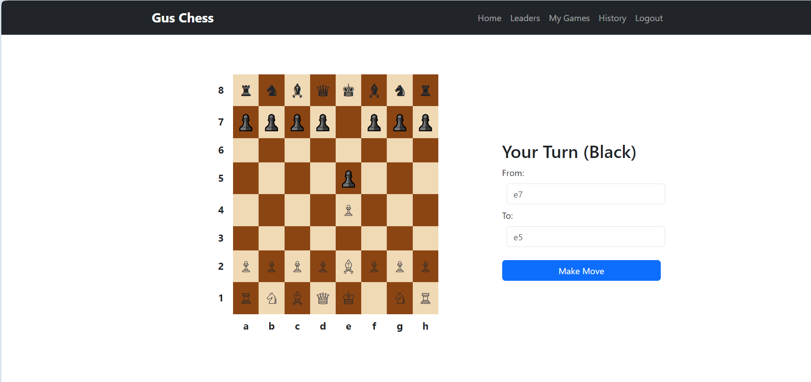
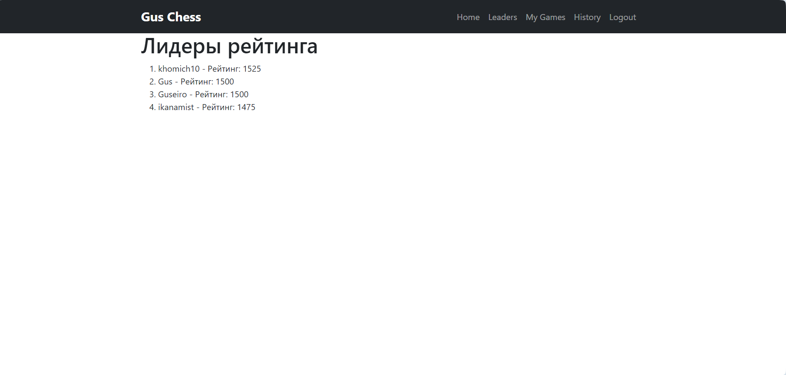
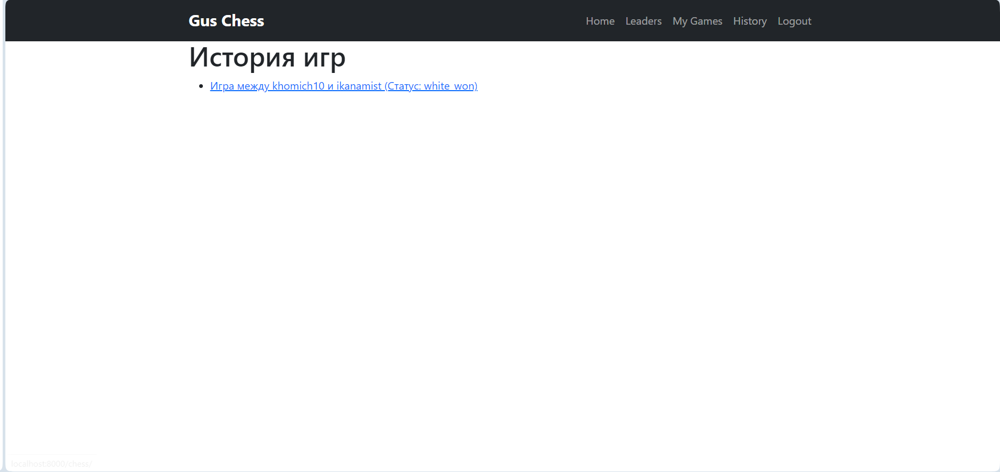
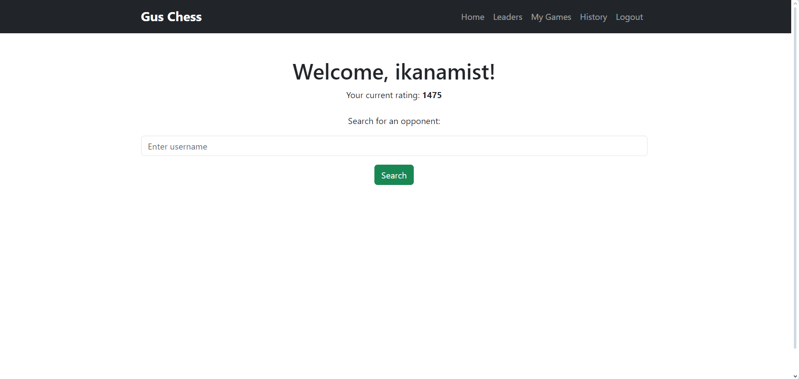

# Chess Game Django Application

This is a Django-based chess application that allows users to play chess online with each other. The project includes a web interface for the chessboard and move handling, user authentication, and a database for game state management.

## Project Description

The **Chess Game Django Application** is a simple, web-based platform that enables two users to play chess in real-time. The game supports standard chess rules and is built using the Django framework. PostgreSQL is used as the database for storing game states, and Docker is used for containerization to simplify deployment and setup.

### Key Features:
- **Real-time chess moves**: Both players can make legal chess moves, and the game keeps track of the board state.
- **User authentication**: Players must log in before starting a game.
- **Persistent game state**: The state of the game is saved to the database after each move, allowing players to return to a game at any time.
- **Docker support**: The application is fully containerized using Docker, making it easy to set up and run locally or in production environments.

---

## Installation and Setup

### Prerequisites

Make sure you have the following installed:
- Docker
- Docker Compose
- Git

## Running the Project Locally

To run the project on your local machine, follow these steps:

### 1. Clone the Repository

Clone the project repository to your local machine:

```bash
git clone https://github.com/your_project.git
cd your_project
```

### 2. Install Dependencies
Create and activate a virtual environment (recommended):

```bash
python -m venv .venv
source .venv/bin/activate  # for Linux/Mac
# or
.venv\Scripts\activate  # for Windows

pip install -r requirements.txt

```

### 3. Apply Database Migrations
Prepare the database by applying migrations:

```bash
python manage.py migrate
```

### 4. Run the Development Server
Start the Django development server with the following command:

```bash
python manage.py runserver
```
Now, the project should be accessible at http://127.0.0.1:8000/.


## Using Docker
If you want to use Docker to run the project, follow these steps:

### 1. Build and Run the Docker Containers
Make sure you have Docker installed. Then use the following command to build and start the containers:

```bash
docker-compose up --build
```

### 2. Access the Project
Once the containers are running, you can access the project at http://localhost:8000.

### 3. Database Setup with Docker
By default, the project is configured to use PostgreSQL with Docker. The docker-compose.yml file sets up the web service (Django) and db service (PostgreSQL).

If you need to run migrations inside the Docker container, use:

```bash
docker-compose exec web python manage.py migrate
```


## Demo



